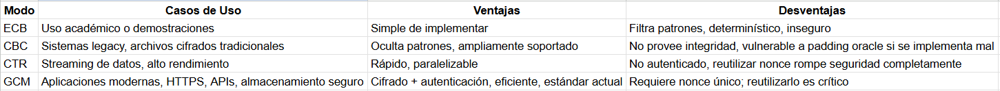

2.1 Análisis de Tamaños de Clave

 ¿Qué tamaño de clave está usando para DES, 3DES y AES? 


 DES:
 Para el tamaño de la clave de DES, se necesita 8 bytes lo cual son 8^2 = 64 bits. De esos bits, 8 bits son de paridad y 56 bits. 

```
    from Crypto.Random import get_random_bytes

    key_des = get_random_bytes(8)

Resultado: b'AA\xe9@\xa2\xab\x0c\xe4'

```


 3DES:
 Para el tamaño de la clave de 3DES, se observa que el tamaño son de 16 bytes o de 24 bytes. 


```
    from Crypto.Cipher import DES3

    key_3des24bytes = DES3.adjust_key_parity(get_random_bytes(24))

    key_3des16bytes = DES3.adjust_key_parity(get_random_bytes(16))

    Resultado:  b'\xa5\xc9\xec[G\xff\x9d=\x08\xdcG\xc3\x19\x04[\xeb'
    
    Resultado:  b'\xd2\xac\xaf\x81\xdaE\xbb\x01\xce`\x86\x94\t~_`\xa8\xfe.\xfeu\x0c\xfd\x1d'


```


AES:
En AES existen tres tipos: 16 bytes, 24 bytes, 32 bytes.

```
    from Crypto.Cipher import DES3

    key_3des = get_random_bytes(24)

    key_3des16 = get_random_bytes(16)

    key_3des32 = get_random_bytes(32)

    Resultado 16 bytes:  b'\xd5$\xb9\xc3\x0b\x1e\x9aQ0\xdc4\xd5\xf9\x06\xd8V'
    Resultado 24 bytes:  b'\x18]\xd22ZN;\xab\xf7\xf2\xc5\xe5T`]G\xcc\xd0?\xa0\x17~\xbf\x02'
    Resultado 32 bytes:  b"\x19\xc4\x90!\xbf\xd6'\x00\xbf\xfe\x1c\x18\x13Y_}\xa5\xb9\xa9\xf1\xdc\xa2\x0e\x8fK9\xbc\xddj\xbc\xcf\x10"

```

Explique por qué DES se considera inseguro hoy en día

Hoy el día se considera inseguro el DES debido a que es poca cantidad de bytes. Al ser 8 bytes, se tienen 56 bits y 8 de ellos se usan por paridad. Entonces al tener 64 bits se puede realizar fuerza bruta a comparación de las otras llaves de 16. Además de eso existen hardware que pueden realizar fuerza bruta en menos tiempo. 


Calcule cuánto tiempo tomaría un ataque de fuerza bruta con hardware moderno?

En el caso de una GPU NVIDIA RTX 3080 donde tiene una potencia de 30 TFLOPS. De acuerdo con esto son 10^10 claves por segundo. 
Por lo tanto si hay una combinación de 2^56=72,057,594,037,927,936 claves se observa que 

2^56 / 10^10 = 83.3 días.


Compare ECB vs CBC mostrando:
o ¿Qué modo de operación implementó en cada algoritmo?
Como se puede observar en el proyecto, se realizo la implementación de 3DES, para el CBC y el EBC. En base a esto se necesita un IV y el modo que se realiza para encriptar las imagenes vistas como por ejemplo pic.png que es un triangulo illuminatti con ciertas palabras "Do I know you?"


¿Cuáles son las diferencias fundamentales entre ECB y CBC?
La diferencia principal en base a los fundamentos entre ECB y CBC es en cómo se procesan los bloques de información. En ECB cada bloque de texto plano se cifra de manera independiente, lo que provoca que bloques iguales produzcan cifrados iguales, dejando patrones visibles y haciéndolo inseguro para aplicaciones reales. En cambio a CBC, se encadena los bloques, ya que cada bloque de texto plano se combina con el bloque cifrado anterior antes de cifrarse y utiliza un vector de inicialización para el primer bloque, lo que introduce aleatoriedad y evita la repetición de patrones. Por ello, CBC es más seguro que ECB, aunque actualmente existen modos más robustos como GCM que ofrecen mayor protección.


¿Se puede notar la diferencia directamente en una imagen?
Como se puede observar en CBC se observa un poco los detalles de la imagen como las figuras del triángulo. A comparación del ECB, no se puede observar las figuras como el triángulo.

En base al snippet de este código, generamos la siguiente imagen:
```
    encrypt_image("../src/images/png/pic.png", "../src/images/png/picecb.png", key, "CBC")
    encrypt_image("../src/images/png/pic.png", "../src/images/png/piccbc.png", key, "ECB")


```


En la imagen original se distinguen claramente los diferentes elementos visuales, como el triángulo animado, el texto y la sombra, conservando sus colores y detalles.


En ECB son visibles patrones estructurales repetitivos de la imagen original, especialmente las formas definidas y contornos del triángulo, la disposición del texto y las zonas de sombra o fondo uniforme. Esto ocurre porque los bloques de píxeles que tienen valores similares lo que conserva la silueta y la distribución espacial de la imagen.


En cambio, en la imagen cifrada con CBC, se observa una fuerte distorsión donde prácticamente se pierden los detalles visuales y la coherencia de los elementos, evidenciando cómo este modo no maneja adecuadamente la información visual al trabajar bloque por bloque sin encadenamiento.


Pregunta: ¿Por qué no debemos usar ECB en datos sensibles?

Al cifrar un mensaje con texto repetido como "ATAQUE ATAQUE ATAQUE" usando AES en modo ECB, los bloques de texto plano que son idénticos producen bloques de texto cifrado también idénticos, lo que puede observarse claramente al dividir el ciphertext en bloques de 16 bytes en hexadecimal, donde algunos bloques se repiten exactamente. 

En ECB cada bloque se cifra de manera independiente. En cambio, al usar CBC, aunque el texto se repita, los bloques cifrados resultan diferentes entre sí, ya que cada bloque se combina con el bloque cifrado anterior mediante una operación XOR y un vector de inicialización (IV), rompiendo la repetición. En un escenario real, esta característica de ECB puede filtrar información estructural, como patrones repetidos en documentos, roles en bases de datos o incluso la forma general de una imagen, permitiendo a un atacante inferir información sin necesidad de conocer la clave.

```
CBC Ciphertext: aa66a9fd739caa8e095c74df32e1d39dddab87a84dd3e5479616255bd75644b8
CBC Decrypted: ATAQUE ATAQUE ATAQUE
ECB Ciphertext: ad0dabe40a20e35548de9ac8e0afbb6f82fceaf4325064749fce9e33cfeed470
ECB Decrypted: ATAQUE ATAQUE ATAQUE

```
Al cifrar el mensaje "ATAQUE ATAQUE ATAQUE ATAQUE" con AES en modo ECB, si el texto se divide en bloques de 16 bytes que resultan idénticos, cada bloque repetido producirá exactamente el mismo bloque cifrado, ya que en ECB cada bloque se cifra de manera independiente con la misma clave. Esto significa que en la salida en hexadecimal pueden observarse patrones repetidos cuando los bloques del texto plano coinciden exactamente. En cambio, al cifrar el mismo mensaje en modo CBC, aunque el texto contenga repeticiones, los bloques cifrados serán diferentes entre sí, porque cada bloque se combina (XOR) con el bloque cifrado anterior y con un vector de inicialización (IV), rompiendo la repetición y evitando patrones visibles. Por ello, ECB puede filtrar información estructural cuando existen bloques idénticos, mientras que CBC oculta esa repetición gracias al encadenamiento.


En un escenario real al utiliza ECB, se puede filtrar información estructural incluso sin conocer la clave, ya que los bloques de texto plano idénticos producen bloques cifrados idénticos. Esto permite a un atacante detectar patrones repetidos, como campos iguales en una base de datos.


¿Qué es el IV y por qué es necesario en CBC pero no en ECB?

Al cifrar el mismo mensaje en modo CBC utilizando la misma clave y el mismo IV, el ciphertext resultante es idéntico en ambos casos, ya que el proceso de encadenamiento comienza desde el mismo valor inicial y sigue exactamente la misma secuencia de operaciones. Sin embargo, cuando se utilizan IVs diferentes, aunque la clave y el mensaje sean los mismos, los ciphertexts resultan completamente distintos, porque el primer bloque depende directamente del IV y esta diferencia se propaga a todos los bloques siguientes. Si un atacante intercepta múltiples mensajes cifrados con el mismo IV, podría detectar cuándo se están enviando mensajes idénticos, lo que filtra información sobre patrones de comunicación y debilita la seguridad del sistema. Por ello, en CBC el IV debe ser único y aleatorio para cada cifrado, aunque no sea secreto.

```
Caso 2 - IV Diferente
Ciphertext 1: b'\xb5j_\x9fu\x12Z\\_\xa8\xe1\x8b\x19S\xfet\xba\x9b\xeean\xf5\x8c\x9f\xcb<\x0br9\xaa\x96\xa6'

Ciphertext 2: b'\x0e\x87O\xe2\xc5\x8b\x02\x02\xceYZl\x14%rR\xb9\xd9\xdb\x9226\xaco^n\xc6\xff\xc1\xd8\xc9M'
¿Son iguales?: False

```

Aunque el texto plano y la clave son exactamente los mismos, los ciphertexts generados son diferentes, lo cual se confirma cuando el programa imprime False en la comparación. Esto ocurre porque en el modo CBC el primer bloque de texto plano se combina (XOR) con el IV antes de cifrarse, por lo que cambiar el IV altera el resultado del primer bloque cifrado y, debido al encadenamiento característico de CBC, esta diferencia se propaga a todos los bloques siguientes. Este comportamiento demuestra que el IV introduce aleatoriedad en el proceso de cifrado. Si un atacante interceptara múltiples mensajes cifrados con el mismo IV y la misma clave, podría detectar cuándo se repiten mensajes idénticos, ya que producirían el mismo ciphertext, lo que representaría una fuga de información estructural. Por esta razón, el IV en CBC debe ser único y aleatorio en cada cifrado.


¿Qué es el padding y por qué es necesario?

El padding es solo agregar bytes adicionales a un mensaje antes de cifrarlo, con el fin de que su longitud sea múltiplo del tamaño de bloque del algoritmo de cifrado. Los cifrados de bloque como DES (8 bytes) o AES (16 bytes) solo pueden procesar datos en bloques completos; si el mensaje no encaja exactamente en ese tamaño, no puede cifrarse correctamente. Por ello, se agregan bytes extra siguiendo una regla específica, como PKCS#7 donde se observa en el snippets.ipynb, donde cada byte añadido indica cuántos bytes de padding se agregaron. El padding es necesario para garantizar que el cifrado funcione correctamente y también para que, al descifrar, el sistema pueda identificar y eliminar de forma segura los bytes añadidos, recuperando el mensaje original. 


¿En qué situaciones se recomienda cada modo de operación? ¿Cómo elegir un modo seguro
en cada lenguaje de programación?

La elección del modo de operación depende del nivel de seguridad requerido y del tipo de aplicación. En la práctica moderna, no se recomienda usar ECB porque filtra patrones. CBC puede usarse si se combina con un mecanismo de autenticación, pero por sí solo no protege contra manipulación de datos. CTR convierte el cifrado en un flujo y es eficiente, pero también necesita autenticación adicional. Actualmente, el modo más recomendado en la mayoría de los lenguajes es GCM, porque proporciona confidencialidad e integridad al mismo tiempo.




Para C# se debe de utilizar AesGcm
```
AesGcm

```

Para javascript se debe de usar AES-GCM

```
AES-GCM

```

Los modos AEAD, como AES-GCM, representan la práctica moderna recomendada en criptografía simétrica. A diferencia de modos tradicionales como ECB, CBC o CTR, que solo proporcionan confidencialidad, los modos AEAD ofrecen simultáneamente confidencialidad, integridad y autenticidad. En el caso de Galois Counter Mode, el algoritmo no solo cifra los datos, sino que también genera un tag de autenticación que permite verificar que el mensaje no ha sido modificado. Por esta razón, AES-GCM es el estándar actual en protocolos como HTTPS (TLS), APIs modernas y sistemas de almacenamiento seguro. Sin embargo, es fundamental que el nonce (IV) sea único para cada cifrado con la misma clave, ya que su reutilización compromete gravemente la seguridad.

```
python .\lab-block-cyphers\src\aes\ctr.py

════════════════════════════════════════════════════════════════════
  AES-256 — ECB / CBC / CTR  — Análisis completo
════════════════════════════════════════════════════════════════════
════════════════════════════════════════════════════════════════════
  SECCIÓN 2 – CTR no requiere padding
════════════════════════════════════════════════════════════════════

  Descripción                         Entrada  CTR salida  CBC salida  CTR == entrada?
  ────────────────────────────────── ────────  ──────────  ──────────  ───────────────
  16 bytes  (bloque exacto)                16          16          32             ✓ Sí
  17 bytes  (1 byte sobre bloque)          17          17          32             ✓ Sí
  33 bytes  (2 bloques + 1 byte)           33          33          48             ✓ Sí
  13 bytes  (no múltiplo de 16)            13          13          16             ✓ Sí
   1 byte   (mínimo)                        1           1          16             ✓ Sí

  Round-trip 31 bytes:  OK ✓
  Original  → b'Cifrado sin padding: 31 bytes!!'
  Descifrado→ b'Cifrado sin padding: 31 bytes!!'

  Conclusión:
  ┌─ CTR genera un keystream del mismo tamaño que el plaintext.
  │  No hay bloques sobrantes, no hay padding que agregar.
  └─ CBC debe rellenar hasta el siguiente múltiplo de 16 (PKCS#7).

════════════════════════════════════════════════════════════════════
  SECCIÓN 3 – Benchmark rendimiento: archivo de 10 MB
════════════════════════════════════════════════════════════════════

  Cifrado de 10 MB  –  5 ejecuciones

  Modo                                      Promedio         Mediana   Velocidad
  ──────────────────────────────────────  ──────────   ─────────────   ─────────
  CBC  (serial  + PKCS#7 padding)            18.0 ms  (mediana 16.9 ms)     556 MB/s
  CTR  (serial  sin padding)                  6.8 ms  (mediana 6.7 ms)    1474 MB/s

  → CTR es 2.6x más rápido que CBC en este sistema.

  ¿Por qué CTR es más rápido?
  ┌─ 1. Sin overhead de padding (no calcula ni agrega bytes extra).
  │  2. Sin dependencia entre bloques → el pipeline del CPU no se detiene.
  │  3. El keystream puede pre-computarse antes de tener el plaintext.
  └─ 4. Mejor aprovechamiento de AES-NI (instrucciones hardware).

════════════════════════════════════════════════════════════════════
  SECCIÓN 4 – Análisis de paralelización
════════════════════════════════════════════════════════════════════

  ┌──────────────────────────────────────────────────────────────┐
  │  CBC – CIFRADO  (dependencia en cadena → NO paralelizable)   │
  │                                                              │
  │  IV ──┐                                                      │
  │       ▼                                                      │
  │  P1 ─XOR─► AES ──► C1 ──┐                                   │
  │                           ▼                                  │
  │                    P2 ─XOR─► AES ──► C2 ──┐                 │
  │                                             ▼                │
  │                                    P3 ─XOR─► AES ──► C3     │
  │                                                              │
  │  Regla:  C[i] = AES( P[i] XOR C[i-1] )                      │
  │  Para cifrar P[i] NECESITAS C[i-1] → espera obligatoria.     │
  │  → Bloques 100% secuenciales. Un solo núcleo de CPU.         │
  └──────────────────────────────────────────────────────────────┘

  ┌──────────────────────────────────────────────────────────────┐
  │  CBC – DESCIFRADO  (parcialmente paralelizable)              │
  │                                                              │
  │  C1 ──► AES_Dec ──XOR── P1    (necesita IV, conocido)       │
  │  C2 ──► AES_Dec ──XOR── P2    (necesita C1, conocido)       │
  │  C3 ──► AES_Dec ──XOR── P3    (necesita C2, conocido)       │
  │                                                              │
  │  Regla:  P[i] = AES_Dec( C[i] ) XOR C[i-1]                  │
  │  Como todos los C[i] ya existen → sí se puede paralelizar.   │
  └──────────────────────────────────────────────────────────────┘

  ┌──────────────────────────────────────────────────────────────┐
  │  CTR – CIFRADO/DESCIFRADO  (100% paralelizable)              │
  │                                                              │
  │  Hilo 1:  AES(nonce‖0) ─XOR─ P1 ──► C1  ┐                  │
  │  Hilo 2:  AES(nonce‖1) ─XOR─ P2 ──► C2  │ Todos al mismo   │
  │  Hilo 3:  AES(nonce‖2) ─XOR─ P3 ──► C3  │ tiempo           │
  │  Hilo 4:  AES(nonce‖3) ─XOR─ P4 ──► C4  ┘                  │
  │                                                              │
  │  Regla:  C[i] = AES( nonce ‖ i )  XOR  P[i]                 │
  │  Solo necesita el nonce (público) y el índice i.             │
  │  Ningún bloque depende del resultado de otro bloque.         │
  │  → Escala perfectamente con más núcleos / GPUs.              │
  └──────────────────────────────────────────────────────────────┘

  Prueba empírica: acceso aleatorio a un bloque específico
  ──────────────────────────────────────────────────
  Descifrar bloque #7 directamente (sin bloques 0-6): OK ✓
  Bytes correctos: 16/16

  Implicación práctica:
  ┌─ Streaming de video cifrado: puedes saltar al minuto 45
  │  sin descifrar los 45 minutos anteriores.
  │  Con CBC esto es imposible; con CTR es trivial.
  └─ Recuperación de errores: un bit corrupto en CTR afecta
     solo 1 bloque. En CBC se propaga al siguiente bloque también.

════════════════════════════════════════════════════════════════════
  SECCIÓN 5 – Tabla comparativa: ECB vs CBC vs CTR
════════════════════════════════════════════════════════════════════
  Propiedad                       ECB             CBC               CTR
  ──────────────────────────────  ────────────    ──────────────    ──────────────
  Tipo de cifrado                 Bloque          Bloque            Flujo (stream)
  Padding requerido               Sí (PKCS#7)     Sí (PKCS#7)       No ✓
  IV / Nonce                      No              Sí (IV 16B)       Sí (nonce 8B)
  Cifrado paralelizable           Sí              No ✗              Sí ✓
  Descifrado paralelizable        Sí              Sí (parcial)      Sí ✓
  Acceso aleatorio                Sí              No ✗              Sí ✓
  Patrones visibles               SÍ ✗✗✗          No ✓              No ✓
  Propagación de errores          1 bloque        2 bloques         1 bloque ✓
  Cifrado == Descifrado           No              No                Sí ✓
  Rendimiento relativo            1×              1×                ~3× más rápido
  ¿Usar en producción?            NUNCA ✗         Con cuidado ⚠     Sí (+ MAC) ✓

  Notas de seguridad:
  ┌─ ECB  → Nunca usar. Bloques iguales producen ciphertext igual.
  │         Revela patrones del mensaje original (ver 'ECB penguin').
  │
  │  CBC  → Seguro con IV aleatorio no predecible. Vulnerable a
  │         ataques de padding oracle si no se autentica el mensaje.
  │
  └─ CTR  → Seguro si el nonce es único por (clave, mensaje).
            Reutilizar nonce con la misma clave es catastrófico:
            C1 XOR C2 = P1 XOR P2  (el keystream se cancela).
            Siempre combinar con un MAC → usar AES-GCM en producción.

════════════════════════════════════════════════════════════════════
  Verificación round-trip de los tres modos
════════════════════════════════════════════════════════════════════

  Mensaje original  (60 bytes): b'Mensaje de prueba con longitud no multiplo de 16: 53 bytes!!'
  CTR round-trip:  OK ✓  (ciphertext 60 bytes, sin padding)
  CBC round-trip:  OK ✓  (ciphertext 64 bytes, con padding → múltiplo de 16)
  ECB round-trip:  OK ✓  (ciphertext 64 bytes, con padding → múltiplo de 16)


```


El modo CTR puede paralelizarse porque cada bloque se procesa de manera independiente usando un contador único, lo que significa que no necesita el resultado de ningún bloque anterior para cifrarse o descifrarse. Esto permite que varios bloques se trabajen al mismo tiempo en diferentes núcleos del procesador o incluso en GPU, mejorando significativamente el rendimiento. En cambio, en CBC el cifrado no puede paralelizarse porque cada bloque depende del bloque cifrado anterior; es decir, el sistema debe esperar a que termine un bloque para poder procesar el siguiente, creando una cadena secuencial obligatoria. Por esta razón, CTR escala mejor en sistemas modernos, mientras que CBC en el proceso de cifrado está limitado por esa dependencia entre bloques.


Investigue e implemente una demostración simplificada de un Padding Oracle Attack:


```

python .\lab-block-cyphers\src\OracleAttack\OracleAttack.py

══════════════════════════════════════════════════════════════════════
  PADDING ORACLE ATTACK — Demostración Completa
══════════════════════════════════════════════════════════════════════

  [Servidor] Cifrando token secreto...
  [Servidor] Plaintext  : b'usuario=admin;rol=superusuario;exp=9999999999'
  [Servidor] Ciphertext : 468ae82aa621c4fe09e01d954ffb46a958571d573727dfe939c4ddbdc9d4266a12a4cdeddd727efa235084d9ae494c20
  [Servidor] IV         : 0a5e5f3c634c2ade8762b7ecf62e55ba
  [Servidor] Bloques    : 3

  [Atacante] Solo conoce el ciphertext y el IV.
  [Atacante] NO conoce la clave.
  [Atacante] Iniciando ataque...

══════════════════════════════════════════════════════════════════════
  SECCIÓN 2 — Matemática del ataque (un solo byte)
══════════════════════════════════════════════════════════════════════

  CBC DESCIFRADO — fórmula:
  ─────────────────────────
    P[i] = AES_Dec( C[i] )  XOR  C[i-1]

  Donde:
    P[i]   = bloque de plaintext i
    C[i]   = bloque de ciphertext i
    C[i-1] = bloque de ciphertext anterior (o IV para el primer bloque)

  ┌─────────────────────────────────────────────────────────────────┐
  │  ATAQUE AL ÚLTIMO BYTE DEL BLOQUE                               │
  │                                                                 │
  │  Meta: descubrir P[i][15]  (último byte del bloque i)           │
  │                                                                 │
  │  1. Tomamos C[i-1] (bloque anterior, conocido)                  │
  │  2. Construimos C'[i-1] = C[i-1] con el último byte modificado: │
  │       C'[i-1][15] = X  (probamos X = 0..255)                    │
  │                                                                 │
  │  3. Enviamos (C'[i-1], C[i]) al oráculo                         │
  │  4. El oráculo descifra:                                        │
  │       P'[i][15] = AES_Dec(C[i])[15]  XOR  X                    │
  │                                                                 │
  │  5. Cuando el oráculo dice "padding OK" con padding=\x01:       │
  │       P'[i][15] = \x01                                         │
  │       → AES_Dec(C[i])[15]  XOR  X  = \x01                     │
  │       → AES_Dec(C[i])[15]          = X  XOR  \x01             │
  │                                                                 │
  │  6. El byte real del plaintext es:                              │
  │       P[i][15] = AES_Dec(C[i])[15]  XOR  C[i-1][15]           │
  │               = (X XOR \x01)        XOR  C[i-1][15]           │
  │                                                                 │
  │  → Hemos descubierto P[i][15] con máximo 256 consultas.         │
  │  → Repetimos para cada byte, de derecha a izquierda.            │
  └─────────────────────────────────────────────────────────────────┘

  Para el byte en posición j (de atrás hacia adelante, j=1..16):
    • Padding objetivo = \x0j  (valor del padding que queremos forzar)
    • Ya conocemos los últimos j-1 bytes intermedios → ajustamos C'
    • Probamos el byte j hasta que el oráculo confirme padding válido
    • Despejamos el byte intermedio y luego el byte real de plaintext

══════════════════════════════════════════════════════════════════════
  SECCIÓN 3 — Ataque byte a byte
══════════════════════════════════════════════════════════════════════

  ────────────────────────────────────────────────────────────────────
  Atacando bloque 1/3
  ────────────────────────────────────────────────────────────────────
    pos[15]  intento=0xd4  intermedio=0xd5  plaintext=0x6f 'o'
    pos[14]  intento=0x25  intermedio=0x27  plaintext=0x72 'r'
    pos[13]  intento=0x16  intermedio=0x15  plaintext=0x3b ';'
    pos[12]  intento=0x9c  intermedio=0x98  plaintext=0x6e 'n'
    pos[11]  intento=0x80  intermedio=0x85  plaintext=0x69 'i'
    pos[10]  intento=0xdc  intermedio=0xda  plaintext=0x6d 'm'
    pos[09]  intento=0x01  intermedio=0x06  plaintext=0x64 'd'
    pos[08]  intento=0xee  intermedio=0xe6  plaintext=0x61 'a'
    pos[07]  intento=0xea  intermedio=0xe3  plaintext=0x3d '='
    pos[06]  intento=0x4f  intermedio=0x45  plaintext=0x6f 'o'
    pos[05]  intento=0x2e  intermedio=0x25  plaintext=0x69 'i'
    pos[04]  intento=0x1d  intermedio=0x11  plaintext=0x72 'r'
    pos[03]  intento=0x50  intermedio=0x5d  plaintext=0x61 'a'
    pos[02]  intento=0x24  intermedio=0x2a  plaintext=0x75 'u'
    pos[01]  intento=0x22  intermedio=0x2d  plaintext=0x73 's'
    pos[00]  intento=0x6f  intermedio=0x7f  plaintext=0x75 'u'

  ────────────────────────────────────────────────────────────────────
  Atacando bloque 2/3
  ────────────────────────────────────────────────────────────────────
    pos[15]  intento=0xcd  intermedio=0xcc  plaintext=0x65 'e'
    pos[14]  intento=0x7f  intermedio=0x7d  plaintext=0x3b ';'
    pos[13]  intento=0x97  intermedio=0x94  plaintext=0x6f 'o'
    pos[12]  intento=0x22  intermedio=0x26  plaintext=0x69 'i'
    pos[11]  intento=0xe2  intermedio=0xe7  plaintext=0x72 'r'
    pos[10]  intento=0x7a  intermedio=0x7c  plaintext=0x61 'a'
    pos[09]  intento=0x92  intermedio=0x95  plaintext=0x75 'u'
    pos[08]  intento=0x72  intermedio=0x7a  plaintext=0x73 's'
    pos[07]  intento=0x82  intermedio=0x8b  plaintext=0x75 'u'
    pos[06]  intento=0xbc  intermedio=0xb6  plaintext=0x72 'r'
    pos[05]  intento=0x4f  intermedio=0x44  plaintext=0x65 'e'
    pos[04]  intento=0xda  intermedio=0xd6  plaintext=0x70 'p'
    pos[03]  intento=0x52  intermedio=0x5f  plaintext=0x75 'u'
    pos[02]  intento=0x95  intermedio=0x9b  plaintext=0x73 's'
    pos[01]  intento=0xb8  intermedio=0xb7  plaintext=0x3d '='
    pos[00]  intento=0x3a  intermedio=0x2a  plaintext=0x6c 'l'

  ────────────────────────────────────────────────────────────────────
  Atacando bloque 3/3
  ────────────────────────────────────────────────────────────────────
    pos[15]  intento=0x68  intermedio=0x69  plaintext=0x03 '\x03'
    pos[14]  intento=0x27  intermedio=0x25  plaintext=0x03 '\x03'
    pos[13]  intento=0xd4  intermedio=0xd7  plaintext=0x03 '\x03'
    pos[12]  intento=0xf4  intermedio=0xf0  plaintext=0x39 '9'
    pos[11]  intento=0x81  intermedio=0x84  plaintext=0x39 '9'
    pos[10]  intento=0xe2  intermedio=0xe4  plaintext=0x39 '9'
    pos[09]  intento=0xfa  intermedio=0xfd  plaintext=0x39 '9'
    pos[08]  intento=0x08  intermedio=0x00  plaintext=0x39 '9'
    pos[07]  intento=0xd9  intermedio=0xd0  plaintext=0x39 '9'
    pos[06]  intento=0xec  intermedio=0xe6  plaintext=0x39 '9'
    pos[05]  intento=0x15  intermedio=0x1e  plaintext=0x39 '9'
    pos[04]  intento=0x02  intermedio=0x0e  plaintext=0x39 '9'
    pos[03]  intento=0x63  intermedio=0x6e  plaintext=0x39 '9'
    pos[02]  intento=0x2e  intermedio=0x20  plaintext=0x3d '='
    pos[01]  intento=0x28  intermedio=0x27  plaintext=0x70 'p'
    pos[00]  intento=0x30  intermedio=0x20  plaintext=0x78 'x'

  ────────────────────────────────────────────────────────────────────
  Ataque completado en 0.13s
  Consultas al oráculo: 5890
  Promedio por byte: 122.7 consultas

══════════════════════════════════════════════════════════════════════
  SECCIÓN 4 — Resultados y estadísticas
══════════════════════════════════════════════════════════════════════

  Plaintext original : b'usuario=admin;rol=superusuario;exp=9999999999'
  Plaintext atacado  : b'usuario=admin;rol=superusuario;exp=9999999999'
  Ataque exitoso     : SÍ ✓

  Estadísticas:
  ┌─ Bytes a descifrar       : 48
  │  Consultas al oráculo    : 5890
  │  Consultas por byte      : 122.7  (máx teórico: 256)
  │  Bloques CBC             : 3
  └─ Complejidad             : O(256 × n_bytes) vs O(2^256) fuerza bruta

  Comparativa de complejidad:
  ┌──────────────────────────────────┬─────────────────────────────┐
  │  Método                          │  Consultas / operaciones    │
  ├──────────────────────────────────┼─────────────────────────────┤
  │  Fuerza bruta AES-256            │  2^256  ≈ 10^77             │
  │  Padding Oracle (este ataque)    │  256 × 48 = 12288    (real: 5890)│
  └──────────────────────────────────┴─────────────────────────────┘

══════════════════════════════════════════════════════════════════════
  SECCIÓN 5 — Contramedidas
══════════════════════════════════════════════════════════════════════

  El ataque funciona porque el servidor revela información sobre el padding.
  Para eliminarlo completamente:

  ┌─────────────────────────────────────────────────────────────────────┐
  │  CONTRAMEDIDA 1 (RECOMENDADA): Usar AES-GCM en lugar de AES-CBC     │
  │                                                                     │
  │  GCM = Galois/Counter Mode                                          │
  │  • Autenticado: incluye un tag HMAC que verifica integridad         │
  │  • Si el tag no coincide → rechazar SIN descifrar                   │
  │  • El atacante nunca llega a ver errores de padding                 │
  │  • Es el estándar moderno (TLS 1.3, JWT, etc.)                      │
  └─────────────────────────────────────────────────────────────────────┘

  ┌─────────────────────────────────────────────────────────────────────┐
  │  CONTRAMEDIDA 2: Encrypt-then-MAC (si se debe usar CBC)             │
  │                                                                     │
  │  1. Cifrar con AES-CBC                                              │
  │  2. Calcular HMAC-SHA256 del ciphertext                             │
  │  3. Verificar el HMAC ANTES de intentar descifrar                   │
  │  → Si HMAC falla, rechazar sin revelar nada sobre el padding        │
  └─────────────────────────────────────────────────────────────────────┘

  ┌─────────────────────────────────────────────────────────────────────┐
  │  CONTRAMEDIDA 3: Respuestas indistinguibles (parche mínimo)         │
  │                                                                     │
  │  • Devolver SIEMPRE el mismo mensaje de error                       │
  │  • Mismo tiempo de respuesta (comparación en tiempo constante)      │
  │  • Nunca revelar si el error fue "padding" vs "autenticación"        │
  │  ⚠ Esto mitiga pero NO elimina el ataque — usar GCM es mejor        │
  └─────────────────────────────────────────────────────────────────────┘

══════════════════════════════════════════════════════════════════════
  BONUS — Implementación segura con AES-GCM
══════════════════════════════════════════════════════════════════════

  [GCM] Ciphertext  : 70a2a975d771ceab81c728a929d4ea05bd63630fac99822cd1b1f8048190c9c3f88e33f302233f2c1fc4396b90d14f8f5e09ca5a05a85317fda1b2cbf9
  [GCM] Nonce       : 383c0eb64ea9f05ee1b96344
  [GCM] Tag incluido: últimos 16 bytes = d14f8f5e09ca5a05a85317fda1b2cbf9
  [GCM] Ataque bloqueado: tag inválido → mensaje rechazado ✓
  [GCM] El atacante no recibe ninguna información sobre el contenido.
  [GCM] Descifrado  : b'usuario=admin;rol=superusuario;exp=9999999999'
  [GCM] Correcto    : ✓

  ¿Por qué GCM es inmune al Padding Oracle?
  ┌─ GCM no usa padding → no hay bytes de padding que explotar.
  │  GCM verifica el tag de autenticación ANTES de descifrar.
  │  Un ciphertext modificado produce tag inválido → rechazo inmediato.
  └─ El atacante no puede distinguir entre "padding malo" y "tag malo".


```

En implementaciones modernas, la mitigación principal contra el Padding Oracle Attack es no usar cifrados sin autenticación, como AES-CBC “solo”. El problema existe porque el servidor descifra antes de verificar la integridad y además revela (explícita o implícitamente) si el padding es válido. La solución más robusta es utilizar modos AEAD (Authenticated Encryption with Associated Data) como AES-GCM o ChaCha20-Poly1305, que combinan confidencialidad e integridad en un solo esquema. En estos modos, el sistema verifica primero el tag de autenticación y, si no coincide, rechaza el mensaje sin descifrarlo, eliminando completamente el canal de información sobre el padding.

Si por compatibilidad se debe usar CBC, la mitigación correcta es aplicar el esquema Encrypt-then-MAC: primero se cifra el mensaje y luego se calcula un HMAC del ciphertext; el servidor debe verificar el HMAC antes de intentar descifrar. Si la verificación falla, se rechaza el mensaje sin procesarlo, evitando que el atacante obtenga retroalimentación sobre el padding. Adicionalmente, se deben usar mensajes de error indistinguibles y comparaciones en tiempo constante para evitar filtraciones por tiempos de respuesta, aunque esto solo mitiga parcialmente el problema.

